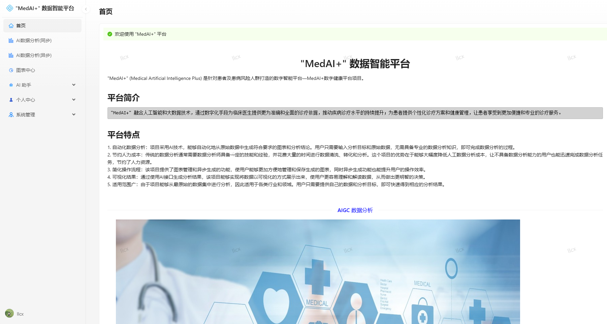
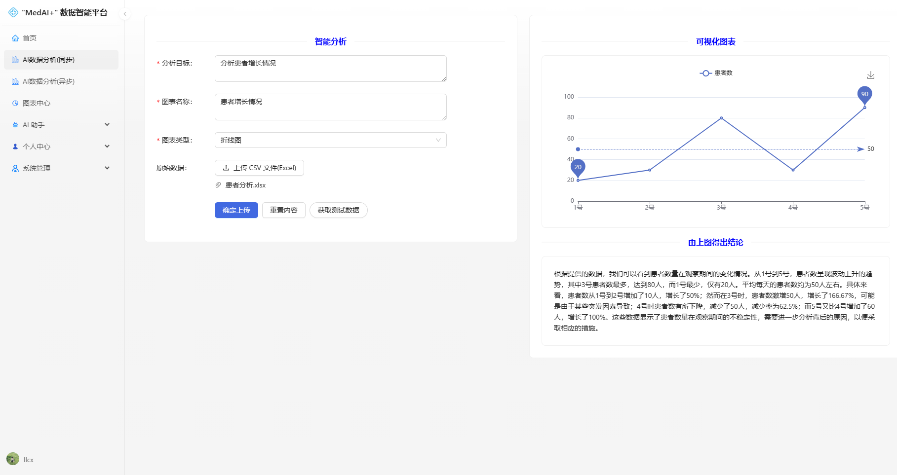
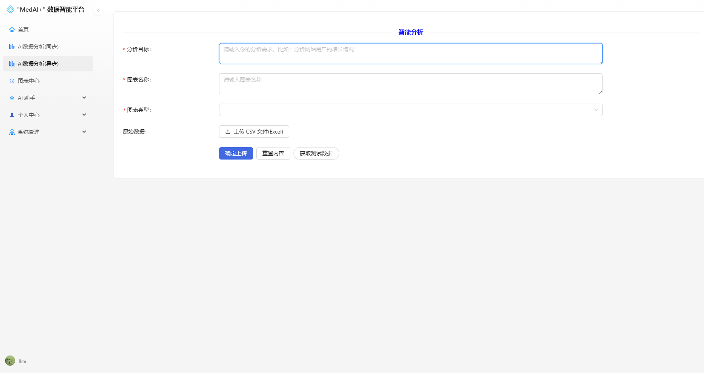

# "MedAI+" 数据智能平台

"MedAI+" (Medical Artificial Intelligence Plus) 是针对患者及患病风险人群打造的数字智能平台—MedAI+数字健康平台项目。

> AIGC ：Artificial Intelligence Generation Content(AI 生成内容)

## 项目介绍
1. 自动化数据分析：项目采用AI技术，能够自动化地从原始数据中生成符合要求的图表和分析结论。用户只需要输入分析目标和原始数据，无需具备专业的数据分析知识，即可完成数据分析的过程。
2. 节约人力成本：传统的数据分析通常需要数据分析师具备一定的技能和经验，并花费大量的时间进行数据清洗、转化和分析。这个项目的优势在于能够大幅度降低人工数据分析成本，让不具备数据分析能力的用户也能迅速完成数据分析任务，节约了人力资源。
3. 简化操作流程：该项目提供了图表管理和异步生成的功能，使用户能够更加方便地管理和保存生成的图表，同时异步生成功能也能提升用户的操作效率。
4. 可视化结果：通过使用AI接口生成分析结果，该项目能够实现将数据以可视化的方式展示出来，使用户更容易理解和解读数据，从而做出更明智的决策。
5. 适用范围广：由于项目能够从最原始的数据集中进行分析，因此适用于各类行业和领域。用户只需要提供自己的数据和分析目标，即可快速得到相应的分析结果。

## 项目核心亮点
1. 自动化分析：通过AI技术，将传统繁琐的数据处理和可视化操作自动化，使得数据分析过程更加高效、快速和准确。
2. 一键生成：只需要导入原始数据集和输入分析目标，系统即可自动生成符合要求的可视化图表和分析结论，无需手动进行复杂的操作和计算。
3. 可视化管理：项目提供了图表管理功能，可以对生成的图表进行整理、保存和分享，方便用户进行后续的分析和展示。
4. 异步生成：项目支持异步生成，即使处理大规模数据集也能保持较低的响应时间，提高用户的使用体验和效率。
5. AI对话功能：除了自动生成图表和分析结果，项目还提供了AI对话功能，可以与系统进行交互，进一步解答问题和提供更深入的分析洞察。
6. 智能数据处理：项目通过AI技术实现了智能化的数据处理功能，能够自动识别和处理各种数据类型、格式和缺失值，提高数据分析效率。

## 项目技术栈
### 后端
1. Spring Boot 2.7.2
2. Spring MVC
3. MyBatis + MyBatis Plus 数据访问
4. Redis：Redisson限流控制
5. IDEA插件 MyBatisX ： 根据数据库表自动生成
6. **RabbitMQ：消息队列**
7. AI SDK
8. JDK 线程池及异步化
9. Swagger + Knife4j 项目文档
10. Easy Excel：表格数据处理

### 前端
1. React 18
2. Umi 4 前端框架
3. Ant Design Pro 5.x 脚手架
4. Ant Design 组件库 
5. OpenAPI 代码生成：自动生成后端调用代码
6. EChart 图表生成

### 数据存储
- MySQL 数据库

## 项目功能
- 用户登录、注册、注销、更新、检索、权限管理、头像上传
- 数据智能分析
- 图表创建、删除、查询、查看愿数据
- AI对话创建、删除、查询
- 个人信息，修改信息，点击头像修改头像

## 单元测试
- JUnit5 单元测试、业务功能单元测试

## "MedAI+" 项目展示
### 用户登录、注册

### 项目首页

### 同步分析数据生成图表

### 异步分析数据生成图表

### 图表管理界面

### 查看图表原始数据

